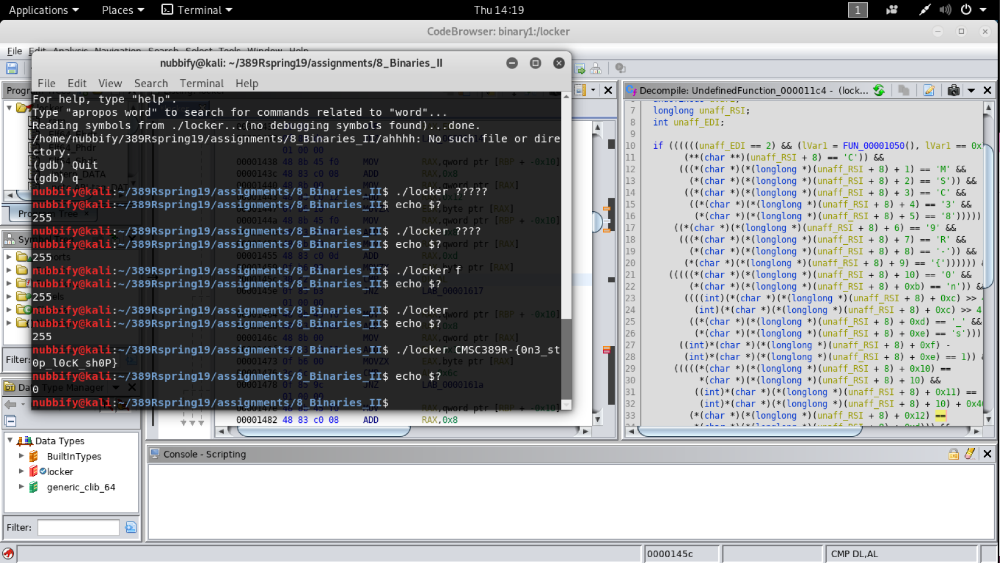

# Extra Credit Writeup - Binaries II

Name: Oscar Bautista
Section: 0101

I pledge on my honor that I have not given or received any unauthorized
assistance on this assignment or examination.

Digital acknowledgement: Oscar Bautista

## Assignment Writeup

### Part 1 (100 Pts)

So I didn't actually use IDA Pro since I wanted to get practice using a 
new reverse engineering tool I learned about at bitcamp: Ghidra. Hopefully 
that doesn't remove too many points. 

The first thing I did was see what I could figure out from using
gdb and inputting random inputs into the binary. Those both were
pretty much immediate dead ends so I started to set up a ghidra project.

Ghidra comes with a decompiler, the same as IDA Pro, and so I used that and
looks for functions until I came across the following decompiled function:

```C
undefined8 UndefinedFunction_000011c4(void)

{
  longlong lVar1;
  undefined8 uVar2;
  longlong unaff_RSI;
  int unaff_EDI;
  
  if ((((((unaff_EDI == 2) && (lVar1 = FUN_00001050(), lVar1 == 0x1d)) &&
        (**(char **)(unaff_RSI + 8) == 'C')) &&
       (((*(char *)(*(longlong *)(unaff_RSI + 8) + 1) == 'M' &&
         (*(char *)(*(longlong *)(unaff_RSI + 8) + 2) == 'S')) &&
        ((*(char *)(*(longlong *)(unaff_RSI + 8) + 3) == 'C' &&
         ((*(char *)(*(longlong *)(unaff_RSI + 8) + 4) == '3' &&
          (*(char *)(*(longlong *)(unaff_RSI + 8) + 5) == '8')))))))) &&
      ((*(char *)(*(longlong *)(unaff_RSI + 8) + 6) == '9' &&
       (((*(char *)(*(longlong *)(unaff_RSI + 8) + 7) == 'R' &&
         (*(char *)(*(longlong *)(unaff_RSI + 8) + 8) == '-')) &&
        (*(char *)(*(longlong *)(unaff_RSI + 8) + 9) == '{')))))) &&
     (((((*(char *)(*(longlong *)(unaff_RSI + 8) + 10) == '0' &&
         (*(char *)(*(longlong *)(unaff_RSI + 8) + 0xb) == 'n')) &&
        ((((int)(*(char *)(*(longlong *)(unaff_RSI + 8) + 0xc) >> 4) |
          (int)(*(char *)(*(longlong *)(unaff_RSI + 8) + 0xc) >> 4) << 4) == 0x33 &&
         ((*(char *)(*(longlong *)(unaff_RSI + 8) + 0xd) == '_' &&
          (*(char *)(*(longlong *)(unaff_RSI + 8) + 0xe) == 's')))))) &&
       ((int)*(char *)(*(longlong *)(unaff_RSI + 8) + 0xf) -
        (int)*(char *)(*(longlong *)(unaff_RSI + 8) + 0xe) == 1)) &&
      (((((*(char *)(*(longlong *)(unaff_RSI + 8) + 0x10) ==
           *(char *)(*(longlong *)(unaff_RSI + 8) + 10) &&
          ((int)*(char *)(*(longlong *)(unaff_RSI + 8) + 0x11) ==
           (int)*(char *)(*(longlong *)(unaff_RSI + 8) + 10) + 0x40)) &&
         (*(char *)(*(longlong *)(unaff_RSI + 8) + 0x12) ==
          *(char *)(*(longlong *)(unaff_RSI + 8) + 0xd))) &&
        ((*(char *)(*(longlong *)(unaff_RSI + 8) + 0x13) == 'l' &&
         (*(char *)(*(longlong *)(unaff_RSI + 8) + 0x14) ==
          *(char *)(*(longlong *)(unaff_RSI + 8) + 0x10))))) &&
       (((((int)*(char *)(*(longlong *)(unaff_RSI + 8) + 0x15) + 9 ==
           (int)*(char *)(*(longlong *)(unaff_RSI + 8) + 0x13) &&
          ((*(char *)(*(longlong *)(unaff_RSI + 8) + 0x16) == 'K' &&
           (*(char *)(*(longlong *)(unaff_RSI + 8) + 0x17) ==
            *(char *)(*(longlong *)(unaff_RSI + 8) + 0xd))))) &&
         (*(char *)(*(longlong *)(unaff_RSI + 8) + 0x18) == 's')) &&
        (((((int)*(char *)(*(longlong *)(unaff_RSI + 8) + 0x19) ==
            (int)*(char *)(*(longlong *)(unaff_RSI + 8) + 0x13) + -4 &&
           (*(char *)(*(longlong *)(unaff_RSI + 8) + 0x1a) ==
            *(char *)(*(longlong *)(unaff_RSI + 8) + 0x14))) &&
          (((int)*(char *)(*(longlong *)(unaff_RSI + 8) + 0x1b) & 0x7fffffffU) == 0x50)) &&
         (*(char *)(*(longlong *)(unaff_RSI + 8) + 0x1c) == '}')))))))))) {
    uVar2 = 0;
  }
  else {
    uVar2 = 0xffffffff;
  }
  return uVar2;
}
```

At this point, I noticed the CMSC and figured that this was where the flag got checked
I figured I'd work through each "&&" and go through this step by step.
The notes I wrote while doing this are as follows and copied straight from the notepad I had open at the time.

>CMSC389R-{0n3_st0p_l0cK_sh0P}
>
>Locations 0x0 to 0xb are just "CMSC389R-{0n"
>
>**Location 0xc is "3" or 0x33 in ascii.
>
>Locations 0xd and 0xe are just "_s"
>
>Location 0xf i "t" is a result of needing to be one apart from the character in 0xe (0xf - 0xe == 1)
>
>Location 0x10 is "0" as it's the same as the character in location 0xa
>
>Location 0x11 is the 0 (48 in ascii) at 0x10 + 64 (0x40) for 112(0x70) in ascii, which is "p"
>
>Location 0x12 is the same as location 0xd so "_"
>
>Location 0x13 is "l"
>
>Location 0x14 is teh same as 0x10 so "0"
>
>Location 0x15 is the same as 0x13 - 9, so 108 - 9 = 99 so "c" in ascii
>
>Location 0x16 is "K"
>
>Location 0x17 is the same as 0xd which is "_"
>
>Location 0x18 is "s"
>
>Location 0x19 is 0x13 - 4 which is 108 - 4 for 104 which is h
>
>Location 0x1a is the same as 0x14 so "0"
>
>**Location 0x1b is a bitwise and with 0x7fffffffU and it will produce 0x50 (01010000) 
>
>	Bitwise and of 0111 1111 1111 1111 1111 1111 1111 1111 
>
> and of 0000 0000 0000 0000 0000 0000 0101 0000
>
>	basically just 0x50, whoops
>
>Location 0x1c is "}"

The stars denote disassembled instructions that I had trouble wrapping my head around at first. 
Generally these were those related to bitwise instructions. 0xc I actually just guessed on by using
the ascii value associated with 0x33 and for the other, I went through and wrote it out before
realizing how simple it actually was. The ones that referenced other locations could have been fairly 
involved but I kept track of what each location stored as I went through which made it easy to go back.

I tested the input that I came up with and got the result desired! Whoo!


